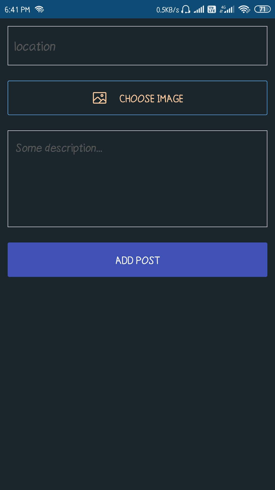
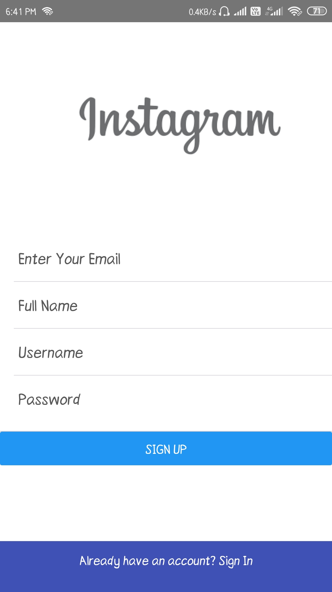
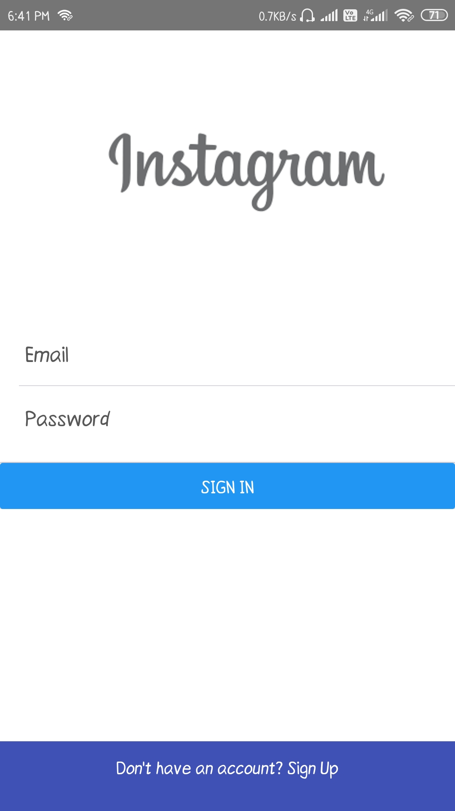

# Demo

# Screens

### Home Page

### Add Post Page

### Sign Up Page

### Sign In Page

### Logout Page

## Technologies Used
* Redux as a State Management Tool
* Firebase as a backend (Storage,Authentication,Realtime Database)
* Native base for UI

